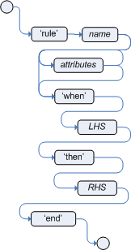

# 规则属性 (Rule Attributes)

规则属性可以配置规则是否启用、是否可循环、优先级等。其中有一些属性比较简单，如优先级：salience，但是有一些属性比较复杂，所以接下来就详细学习一下这些规则的属性，并结合代码片段看这些规则如何使用。

## no-loop:

作用：当fact对象被规则修改时，可能会导致规则再次激活，导致无限循环。当规则声明为no-loop时，即设置当前的规则，只执行一次，如果本身的RHS部分有update等触发规则重新执行的操作，也不要再次执行当前规则。但是有可能被其他规则触发！
类型： Boolean
默认值： false

## lock-on-active:

作用： 加强版no-loop，通过这个标签，可以控制当前的规则只会被执行一次。如果有一些修改Fact对象的规则并且不希望其他任何规则重新匹配和重新触发这个规则，可使用该属性。通常该属性会配合下面的 ruleflow-group或agenda-group使用。
类型： Boolean
默认值： false

## salience:

作用： 规则的优先级，可以是正数也可以是负数。数字越大代表优先级越高。同时支持动态值，写法如下：
类型： integer
默认值： 0

## dialect:

作用： 规则方言，现支持java or mvel
类型： String
默认值： 默认为java

## ruleflow-group:

* 作用： Ruleflow 可以显示的控制规则组执行顺序，可结合jBPM工作流引擎使用。
* 类型： String
* 默认值： N/A
* 类型： String
* 默认值： MAIN

## auto-focus:

* 作用： 设置规则组自动获取焦点，结合agenda-group使用。
* 类型： Boolean
* 默认值： false

## activation-group:

* 作用： 属于同一个activation-group的规则，如有一条规则被激活，则其他规则就不再执行。
* 类型： String
* 默认值： N/A

## date-effective:

* 作用： 规则生效时间
* 类型： String，包含日期和时间定义
* 默认值： N/A

## date-expires:

* 作用： 规则失效时间
* 类型： String，包含日期和时间定义
* 默认值： N/A

## duration:

* 作用： 规则多次时间后执行，如duration 3000 3秒后执行规则
* 类型： long
* 默认值： N/A
