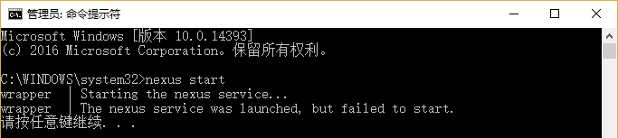

## Sonatype Nexus 服务启动失败问题解决

> 问题前述: 近日在开发机本机安装了 Oracle 数据库快捷版 11g2 之后，重启电脑后发现本机的maven代理服务无法访问。<br/>

## 现象

1. 通过 Windows 服务窗口启动nexus 服务，失败（报1067错误）

2. 通过命令窗口执行 `nexus start` 失败，重新安装服务后再次执行后依然错误

    

3. 通过命令窗口执行 `%NEXUES_HOME%\bin\jsw\windows-x86-64\console-nexus.bat` 脚本，nexus服务正常启动了！！

*这个时候想到之前安装MySQL时，服务无法启动报1067错误几乎都是配置不正确（多半是路径配置不对）*


在查看了nexus 启动脚本后，发现了以下两个文件：

* `%NEXUES_HOME%\bin\jsw\conf\wrapper.conf`
* `%NEXUES_HOME%\logs\wrapper.log`

## 服务启动日志

`wrapper.log` 文件中提示信息表明可能是找不到JDK...

```
wrapper  | Starting the nexus service...
wrapper  | --> Wrapper Started as Service
wrapper  | Launching a JVM...
wrapper  | Unable to execute Java command.  系统找不到指定的文件。 (0x2)
wrapper  |     "java" -XX:MaxPermSize=192m -Djava.io.tmpdir=./tmp -Djava.net.preferIPv4Stack=true -Dcom.sun.jndi.ldap.connect.pool.protocol="plain ssl" -Xms256m -Xmx768m -Djava.library.path="bin/jsw/lib" -classpath "bin/jsw/lib/wrapper-3.2.3.jar;./lib/javax.servlet-3.0.0.v201112011016.jar;./lib/jetty-client-8.1.16.v20140903.jar;./lib/jetty-continuation-8.1.16.v20140903.jar;./lib/jetty-deploy-8.1.16.v20140903.jar;./lib/jetty-http-8.1.16.v20140903.jar;./lib/jetty-io-8.1.16.v20140903.jar;./lib/jetty-jmx-8.1.16.v20140903.jar;./lib/jetty-rewrite-8.1.16.v20140903.jar;./lib/jetty-security-8.1.16.v20140903.jar;./lib/jetty-server-8.1.16.v20140903.jar;./lib/jetty-servlet-8.1.16.v20140903.jar;./lib/jetty-util-8.1.16.v20140903.jar;./lib/jetty-webapp-8.1.16.v20140903.jar;./lib/jetty-xml-8.1.16.v20140903.jar;./lib/jul-to-slf4j-1.7.6.jar;./lib/logback-access-1.1.2.jar;./lib/logback-classic-1.1.2.jar;./lib/logback-core-1.1.2.jar;./lib/metrics-core-2.2.0.jar;./lib/metrics-jetty-2.2.0.jar;./lib/metrics-logback-2.2.0.jar;./lib/nexus-bootstrap-2.14.1-01.jar;./lib/plexus-interpolation-1.16.jar;./lib/slf4j-api-1.7.6.jar;./conf/" -Dwrapper.key="JlwJUuCCKkcPjWXm" -Dwrapper.port=32000 -Dwrapper.jvm.port.min=31000 -Dwrapper.jvm.port.max=31999 -Dwrapper.pid=8860 -Dwrapper.version="3.2.3" -Dwrapper.native_library="wrapper" -Dwrapper.service="TRUE" -Dwrapper.cpu.timeout="10" -Dwrapper.jvmid=1 org.sonatype.nexus.bootstrap.jsw.JswLauncher ./conf/jetty.xml ./conf/jetty-requestlog.xml
wrapper  | Critical error: wait for JVM process failed
wrapper  | The nexus service was launched, but failed to start.

```

## 解决方式

打开编辑文件`%NEXUES_HOME%\bin\jsw\conf\wrapper.conf`。在修改如下配置，将`wrapper.java.command`的值设置为正确的java路径。之后再进行启动nexus服务即可。

```
# Set the JVM executable
# (modify this to absolute path if you need a Java that is not on the OS path)
wrapper.java.command=%JAVA_HOME%\bin\java.exe

```

## 使用Sonatype Nexus搭建Maven私有仓库

1.1	使用Sonatype Nexus搭建Maven私有仓库
1.1.1	私有仓库的优点
1.	服务器在内网，下载速度快
2.	一个人使用过，其它再次使用不需要重复下载，减少对外流量
3.	发布团队自有私有类库
1.1.2	安装Sonatype Nexus
本次安装系统环境 debian/ubuntu 首先去官方网站 http://www.sonatype.org/nexus/可以看到Nexus有两种发放形式，war包
可以直接部署到tomcat下。tgz or zip可以直接执行的版本。我们首先看看tgz版本的安装方法。
1.	下载 wget http://www.sonatype.org/downloads/nexus-latest-bundle.tar.gz
2.	另外运行nexus需要有jre支持如果没有安装可以通过 apt-get install default-jre 来进行安装 请确认你安装的jre版本是否大于1.7
3.	将 nexus cp 到 /usr/local/ 目录下再进行解压缩
    ```shell
    sudo cp nexus-2.8.0-05-bundle.tar.gz /usr/local
    cd /usr/local
    sudo tar xvzf nexus-2.8.0-05-bundle.tar.gz
    ln -s nexus-2.8.0-05 nexus
    ```
8.	运行Nexus,/usr/local/nexus/bin/nexus console。当启动成功可以看到如下提示
9.	Running Nexus OSS...
10.	wrapper  | --> Wrapper Started as Console
11.	wrapper  | Launching a JVM...
12.	jvm 1    | Wrapper (Version 3.2.3) http://wrapper.tanukisoftware.org
13.	jvm 1    |   Copyright 1999-2006 Tanuki Software, Inc.  All Rights Reserved.
14.	如果以上步骤没有报错即可，至浏览器访问http://nexus.host:8081/nexus/。
no zuo no die。采用这种方式安装的有个天生缺陷，对CPU的支持有限。查看bin/jsw目录会发现 linux-ppc-64 linux-x86-32 linux-x86-64 macosx-universal-32 macosx-universal-64 solaris-sparc-32 solaris-sparc-64 solaris-x86-32 windows-x86-32 windows-x86-64 如果我们的CPU在以上类型以外比如树霉派的ARM类型。那么你将要学习如下安装方法。使用WAR包安装
1.	安装tomcat7
2.	下载war包 wget http://download.sonatype.com/nexus/oss/nexus-2.10.0-02.war
3.	将war包拷贝到 {TOMCAT_HOME}/webapps,在目录 /usr/share/tomcat7下创建 sonatype-work目录，并将所有者修改为 tomcat7
4.	此时查看机器负载配置不高的单核机器很快就会跑到1.7，稍等片刻
5.	再次打开你的浏览器 http://nexus.host:8080/nexus/记得修改端口tomcat默认商品和刚刚的tgz目录可不一样。

1.1.3	下载中央仓库包
1.	点击左侧 Repositories,在列表中选择 Central 。打开Configuration标签，将Download Remote Indexes改为True即可开始自动下载。
2.	如果你不幸在中国大陆，连中央仓库下载索引会慢的要死。解决方案有二。
    a. 打开你仓库的配置节点，修改HTTP Request Settings->Request Timeout改的大点我基本都是3小时左右超时。
    b. 手工下载索引文件，然后按官方路径放置。修改你机器的HOSTS文件把repo1.maven.org域名指向你的假机器即可
1.1.4	Maven私有库的使用
 在你的~/.m2/目录下增加一个新文件settings.xml，之后再使用Maven时就会在本地Nexus仓库进行下载。。文件内容为
```xml
<settings>
    <mirrors>
        <mirror>
            <!--This sends everything else to /public -->
            <id>nexus</id>
            <mirrorOf>*</mirrorOf>
            <url>http://localhost:8080/nexus/content/groups/public</url>
        </mirror>
    </mirrors>
    <profiles>
        <profile>
            <id>nexus</id>
            <!--Enable snapshots for the built in central repo to direct -->
            <!--all requests to nexus via the mirror -->
            <repositories>
                <repository>
                    <id>central</id>
                    <url>http://central</url>
                    <releases><enabled>true</enabled></releases>
                    <snapshots><enabled>true</enabled></snapshots>
                </repository>
            </repositories>
            <pluginRepositories>
                <pluginRepository>
                    <id>central</id>
                    <url>http://central</url>
                    <releases><enabled>true</enabled></releases>
                    <snapshots><enabled>true</enabled></snapshots>
                </pluginRepository>
            </pluginRepositories>
        </profile>
    </profiles>
    <activeProfiles>
        <!--make the profile active all the time -->
        <activeProfile>nexus</activeProfile>
    </activeProfiles>
</settings>
```

1.1.5	后续
当然Nexus功能或要学习的东西还不止这些。比如怎么在Nexus上部署Nuget,让.Net程序可以来这下载包。怎么上传自己私有的JAR包，如果监控NEXUS状态。我会在今后的BLOG上继续更新。
